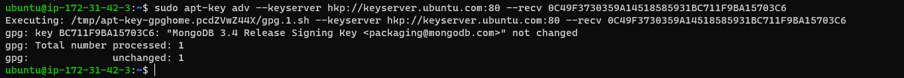
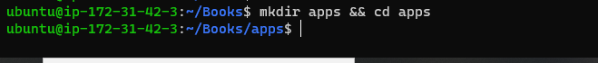

## Step1 

## Install NodeJs

`sudo apt update`

`sudo apt upgrade`

`sudo apt install -y nodejs`

## Step 2

## Install MongoDB

`sudo apt-key adv --keyserver hkp://keyserver.ubuntu.com:80 --recv 0C49F3730359A14518585931BC711F9BA15703C6`

`sudo apt install -y mongodb`

`sudo systemctl status mongodb`

`sudo apt install -y npm`

`sudo npm install body-parser`

`mkdir Books && cd Books`

`npm init`

`vi server.js`

## Step 3

##  INSTALL EXPRESS AND SET UP ROUTES TO THE SERVER

`sudo npm install express mongoose`

`mkdir apps && cd apps`

`vi routes.js`

`mkdir models && cd models`

`vi book.js`

## Step 4

`mkdir public && cd public`

`vi script.js`

`vi index.html`

`node server.js`

`TCP - 3300`

`curl -s http://169.254.169.254/latest/meta-data/public-ipv4`

`web book`

